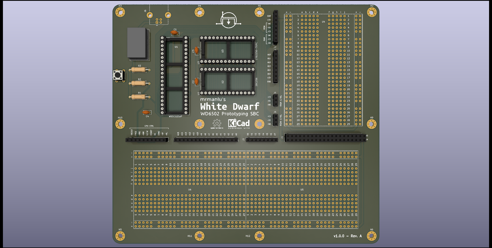

# WD6502
Prototyping SBC based on W65C02 CPU

## Why?
This is a minimal CPU<->RAM<->ROM interconnection to achieve a fast breadboard prototyping, minimizing bad connections occurred when connecting several jumper wires.

There is no fixed memory map. Freedom for everyone! There exists a half-sized breadboard in the upper-right zone of the PCB to create the address decoding circuit. Also, there exists a lower full-sized breadboard to connect peripherals: VIAs, ACIAs, SD card breakout boards,... 

## Contributing
This project is in its first steps. Feel free to contibute/fork as you want. **I'm a newbie in HW design, so please do constructive criticism!**
